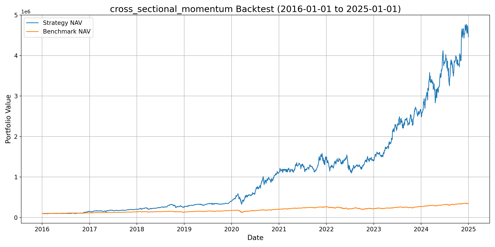
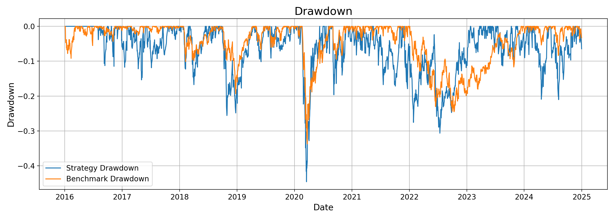
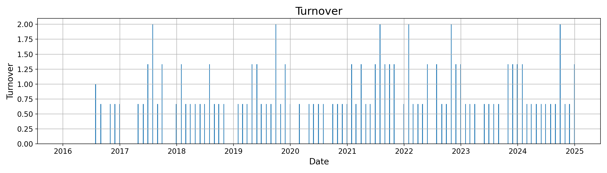

# Quantitative Backtesting Framework (Python)

A modular and extensible Python backtesting framework for systematic trading strategy research.

This project supports multiple strategies, YAML-based configuration, and reproducible experiment management. It is designed for rapid strategy prototyping, performance evaluation, and structured experiment tracking.

## Features

- Unified backtesting engine
- Multi-strategy support 
- YAML-based configuration system
- Portfolio simulation with transaction cost and turnover modelling
- Performance evaluation:
  - total return
  - Sharpe ratio
  - max drawdown
- Visualization:
  - equity curve
  - drawdown curve
  - turnover chart

## Project Structure

```text
.
├── main.py
├── download_data.py
├── requirements.txt
├── README.md
├── config/
│   ├── backtest.yaml
│   └── strategies/
│       ├── cross_sectional_momentum.yaml
│       └── moving_average_crossover.yaml
├── core/
│   ├── backtester.py
│   ├── strategy_base.py
│   └── calendar_utils.py
├── strategies/
│   ├── cross_sectional_momentum.py
│   ├── moving_average_crossover.py
│   ├── registry.py
│   └── factory.py
├── data_loader/
│   └── price_loader.py
├── analysis/
│   ├── metrics.py
│   └── plotting.py
├── utils/
│   └── config_loader.py
├── data/
└── output/
```

## Installation

Clone the repository and install the required packages:

```bash
pip install -r requirements.txt
```

## Requirements

Main dependencies:

- pandas
- numpy
- matplotlib
- pyyaml
- yfinance

## Data Preparation

This project uses Yahoo Finance data via `yfinance`.

To download and save the historical price data locally:

```bash
python download_data.py
```

The script will generate:

- `data/combined_close.csv`
- individual price files under `data/raw/`

## Configuration

### Global backtest config

Edit:

```text
config/backtest.yaml
```

This file controls:

- ticker universe
- benchmark
- start / end dates
- initial capital
- rebalance frequency
- transaction cost
- minimum history requirement
- active strategy name

Example:

```yaml
strategy_name: "cross_sectional_momentum"
benchmark: SPY
rebalance_freq: "M"
transaction_cost: 0.001
```

### Strategy-specific config

Each strategy has its own config file under:

```text
config/strategies/
```

Examples:

- `cross_sectional_momentum.yaml`
- `moving_average_crossover.yaml`

## Run the Backtest

After preparing the data and configuration:

```bash
python main.py
```

## Supported Strategies

### 1. Cross-sectional momentum
Ranks assets by historical return over a lookback window and selects the top-N assets.

### 2. Moving average crossover
Uses short-term and long-term moving averages to identify trend-following candidates, then selects top-N assets by crossover strength.

## Example Strategy Output

Below is an example output figure generated by the framework, showing the equity curve, drawdown, and turnover chart for a sample backtest run.





## Output Structure

Each run creates a timestamped output folder:

```text
output/
└── <strategy_name>/
    └── <timestamp>/
        ├── backtest_result.csv
        ├── backtest_summary.csv
        ├── equity_curve.svg
        ├── equity_curve.png
        ├── drawdown_curve.svg
        ├── drawdown_curve.png
        ├── turnover_bar.svg
        ├── turnover_bar.png
        └── configs/
            ├── backtest.yaml
            └── <strategy_name>.yaml
```

This makes experiments reproducible and prevents overwriting previous results.

## Add a New Strategy

To add a new strategy:

1. Choose a unique `strategy_name` in snake_case  
   Example: `your_strategy`

2. Add a strategy config YAML  
   Create:
   `config/strategies/your_strategy.yaml`

3. Add a strategy config dataclass and loader  
   In `utils/config_loader.py`, add:
   - `Your_StrategyConfig`
   - `load_your_strategy_config()`

4. Implement the strategy class  
   Create:
   `strategies/your_strategy.py`

   Requirements:
   - inherit from `BaseStrategy`
   - implement `prepare()`
   - implement `generate_target_weights()`
   - set:
     ```python
     super().__init__(strategy_name="your_strategy")
     ```

5. Register the strategy  
   In `strategies/registry.py`, add:
   - `strategy_class`
   - `config_loader`

6. Switch the active strategy in `config/backtest.yaml`  
   Example:
   ```yaml
   strategy_name: "your_strategy"
   ```

## Naming Rules

- `strategy_name`: snake_case
- strategy file: snake_case
- strategy YAML: snake_case
- registry key: snake_case
- class name: PascalCase + `Strategy`
- config dataclass: PascalCase + `Config`
